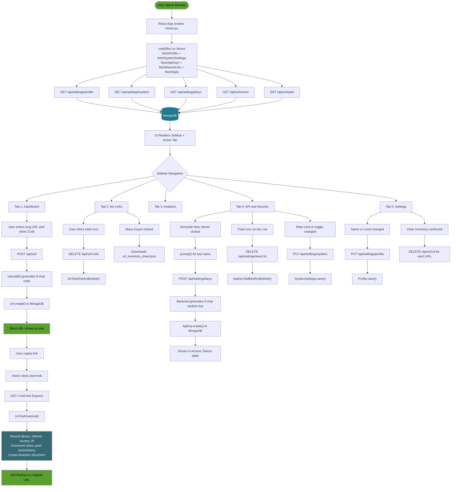

# CraftURL — Project Documentation

> **App:** CraftURL — A full-stack URL shortener with a gamified pixel-art UI
> **Stack:** React (Create React App + Tailwind CSS) · Node.js / Express · MongoDB (Mongoose)
> **Last Updated:** 2026-05-24

---

## Table of Contents

1. [Project Structure](#1-project-structure)
2. [Environment Variables & API Keys](#2-environment-variables--api-keys)
3. [Backend API Reference](#3-backend-api-reference)
4. [Page / Section Breakdown](#4-page--section-breakdown)
   - [4.1 Dashboard](#41-tab-1--dashboard)
   - [4.2 My Links (URL Inventory)](#42-tab-2--my-links-url-inventory)
   - [4.3 Analytics Realm](#43-tab-3--analytics-realm)
   - [4.4 API & Security (System Controls)](#44-tab-4--api--security-system-controls)
   - [4.5 Settings (Crafter Settings)](#45-tab-5--settings-crafter-settings)
   - [4.6 Craft New Link Modal](#46-craft-new-link-modal)
   - [4.7 Footer](#47-footer)
5. [Access Tokens / API Keys — Deep Dive](#5-access-tokens--api-keys--deep-dive)
6. [Database Models](#6-database-models)
7. [Application Flowchart](#7-application-flowchart)

---

## 1. Project Structure

```
short_Url/
├── index.js                  # Express server entry point
├── DbConnect.js              # MongoDB connection
├── .env                      # Backend env vars (MONGOURL, PORT)
├── vercel.json               # Vercel deployment config
│
├── Router/
│   ├── Api.js                # Root API router (/api)
│   ├── Url.js                # URL routes (/api/url/*)
│   └── Settings.js           # Settings routes (/api/settings/*)
│
├── Controller/
│   ├── UrlController.js      # URL shortening logic + analytics
│   └── SettingsController.js # Profile, system settings, API keys
│
├── Model/
│   ├── Url.js                # URL + click history schema
│   ├── Analytics.js          # Detailed click event schema
│   ├── ApiKey.js             # API access token schema
│   ├── Profile.js            # User profile schema
│   └── SystemSettings.js     # System configuration schema
│
├── middleware/
│   └── middleware.js         # Request logging middleware
│
├── Utils/
│   └── ResponseWrapper.js    # Standardised success/error response
│
└── client/                   # React front-end (CRA)
    ├── .env                  # REACT_APP_BACKEND_URL
    └── src/
        ├── App.js            # Root component (renders Home)
        ├── pages/
        │   ├── Home.jsx      # Entire SPA (5 tabs, 1736 lines)
        │   ├── Footer.jsx    # Footer bar
        │   ├── home.css      # Custom CSS animations
        │   └── Footer.css    # Footer styles
        └── context/
            └── ThemeContext.js  # Light/dark theme context (unused in production yet)
```

---

## 2. Environment Variables & API Keys

### 2.1 Backend — `/short_Url/.env`

| Variable    | Default                             | Description                                    |
|-------------|-------------------------------------|------------------------------------------------|
| `MONGOURL`  | `mongodb://localhost:27017/`        | MongoDB connection string                      |
| `PORT`      | `4000`                              | Express server port                            |

> **IMPORTANT:** For production, set `MONGOURL` to your MongoDB Atlas connection string.
> Example: `MONGOURL=mongodb+srv://<user>:<pass>@cluster0.xxxxx.mongodb.net/crafturl`

### 2.2 Frontend — `/short_Url/client/.env`

| Variable                  | Current Value               | Description                              |
|---------------------------|-----------------------------|------------------------------------------|
| `REACT_APP_BACKEND_URL`   | `http://localhost:4000`     | Base URL of the Express backend          |

> **WARNING:** This value **must** match the deployed backend URL in production, e.g.:
> `REACT_APP_BACKEND_URL=https://your-api.vercel.app`

### 2.3 API Keys (Access Tokens) — In-App Feature

The app manages its **own API access tokens** stored in MongoDB (the `ApiKey` collection). These are **not** third-party service keys — they are generated by the app itself for developer/programmatic access.

| Field       | Description                                                |
|-------------|------------------------------------------------------------|
| `name`      | Human-readable label (e.g. `Mobile_Prod_App`)              |
| `key`       | 4-character random alphanumeric identifier (e.g. `xk92`)   |
| `status`    | `ACTIVE` or `REVOKED`                                      |
| `lastUsed`  | String timestamp or `--`                                   |
| `createdAt` | Auto-generated MongoDB timestamp                           |

**How a new key is generated:**
```
User clicks "Generate_New_Secret"
  → prompt() for name
  → POST /api/settings/keys
  → Backend: Math.random().toString(36).substring(2, 6)
  → Saved to MongoDB ApiKey collection
  → Displayed in UI table
```

> **NOTE:** Currently the API key is **only stored and displayed** — it is **not validated on incoming requests**.
> To enforce key-based access control, `middleware/middleware.js` must be updated to check the `Authorization` header against the `ApiKey` collection.

---

## 3. Backend API Reference

### Base URL
- **Local:** `http://localhost:4000`
- **Production:** set via `REACT_APP_BACKEND_URL`

### 3.1 URL Endpoints — `/api/url`

| Method   | Endpoint            | Description                                         | Middleware      |
|----------|---------------------|-----------------------------------------------------|-----------------|
| `POST`   | `/api/url/`         | Create a new short URL (generates 8-char `nanoid`)  | `middleware.js` |
| `GET`    | `/api/url/recent`   | Fetch last 15 created URLs sorted by `createdAt`    | none            |
| `GET`    | `/api/url/stats`    | Aggregate global click stats (devices, biomes, etc) | none            |
| `DELETE` | `/api/url/:id`      | Delete a URL by its `nnid`                          | none            |

### 3.2 Redirect Endpoint

| Method | Endpoint  | Description                                                               |
|--------|-----------|---------------------------------------------------------------------------|
| `GET`  | `/:id`    | Look up `nnid`, record analytics event, then `302` redirect to origin URL |

### 3.3 Settings Endpoints — `/api/settings`

| Method   | Endpoint                  | Description                                |
|----------|---------------------------|--------------------------------------------|
| `GET`    | `/api/settings/profile`   | Get user profile (creates default if none) |
| `PUT`    | `/api/settings/profile`   | Update `name`, `level`, `avatar`           |
| `GET`    | `/api/settings/system`    | Get system settings (creates defaults)     |
| `PUT`    | `/api/settings/system`    | Update rate limits, toggles, replicas      |
| `GET`    | `/api/settings/keys`      | List all API keys (seeds defaults if none) |
| `POST`   | `/api/settings/keys`      | Create a new API key (name required)       |
| `DELETE` | `/api/settings/keys/:id`  | Delete an API key by MongoDB `_id`         |

---

## 4. Page / Section Breakdown

The entire client is a **Single Page Application (SPA)** — there is only **one route** (`/`). Navigation is controlled by the `activeTab` state in `Home.jsx`. The sidebar controls which tab is rendered.

---

### 4.1 Tab 1 — Dashboard

**State:** `activeTab === 'dashboard'`

**Purpose:** Landing view. Lets users quickly shorten a URL and see an activity overview.

| Section                  | What it does                                                                                              |
|--------------------------|-----------------------------------------------------------------------------------------------------------|
| **Craft New Link panel** | Form input. On submit → `POST /api/url/` with `{ url, name }`. Displays short URL with copy button.       |
| **Stats Grid (3 cards)** | Total XP (Clicks) = real DB + 124,582 baseline. Geographic Reach (hardcoded 48 biomes). Link Uptime (hardcoded 99.9%). |
| **Recent Crafting list** | `GET /api/url/recent` on mount. Shows 5 most recent links. Copy & delete per row. Filtered by search bar. |
| **Pro Crafter Tip**      | Static informational card about custom aliases.                                                           |
| **Ender-API is LIVE**    | Static promotional card for the API.                                                                      |

**API calls:** `GET /api/url/recent`, `GET /api/url/stats`, `GET /api/settings/profile`, `GET /api/settings/system`, `GET /api/settings/keys`, `POST /api/url/`, `DELETE /api/url/:nnid`

---

### 4.2 Tab 2 — My Links (URL Inventory)

**State:** `activeTab === 'my_links'`

**Purpose:** Full grid view of all shortened URLs displayed as inventory cards with health indicators.

| Section                    | What it does                                                                                                   |
|----------------------------|----------------------------------------------------------------------------------------------------------------|
| **Action Toolbar**         | Mass Delete (all URLs), Mass Export (downloads JSON), Search filter, Sort (reverse order).                     |
| **URL Card Grid**          | Each card: short alias, destination URL, click count, Link Health % (100% HTTPS+clicks / 45% HTTPS / 12% HTTP), security badge, copy + delete buttons. |
| **Empty Slot card**        | Opens the Craft New Link modal.                                                                                 |
| **Total Inventory Weight** | `(url count × 128) + 1248 + real clicks` shown as progress bar.                                                |
| **Global Security Status** | Static badges: XSS Protection, CORS Validation, HTTPS Mandatory.                                              |

**API calls:** `DELETE /api/url/:nnid` (per delete or mass delete)

---

### 4.3 Tab 3 — Analytics Realm

**State:** `activeTab === 'analytics'`

**Purpose:** Visual analytics showing click performance, geographic reach, referrers, and device breakdown.

| Section                     | What it does                                                                                                   |
|-----------------------------|----------------------------------------------------------------------------------------------------------------|
| **Header KPI cards**        | Total XP (real + 124,582 baseline). Unique Players (real unique IPs + 12,043 baseline).                        |
| **Click Trends line graph** | SVG chart: green line (total clicks), cyan dashed line (unique players) across MON–SUN. Toggle 7 / 30 cycles.  |
| **Player World Map**        | SVG world map with top biome label. Breakdown: United Realms / Euro-Spawners / Asian Biomes percentages.       |
| **Mob Spawner Stats**       | Referrer bars: Direct Connect, Social Spawners, Search Explorers.                                              |
| **Device Enchantments**     | 4-tile grid: Desktop / Mobile / Tablet / Misc percentages.                                                     |

**API calls:** Data from `GET /api/url/stats` (fetched on app mount)

---

### 4.4 Tab 4 — API & Security (System Controls)

**State:** `activeTab === 'api_security'`

**Purpose:** Admin panel for Docker service replicas, rate limits, URL validation toggles, and API access tokens.

| Section                    | What it does                                                                                                        |
|----------------------------|---------------------------------------------------------------------------------------------------------------------|
| **Docker Resources panel** | `resolution-svc` and `analytics-svc` cards with CPU %, replica count, and Scale Up (+) button → `PUT /api/settings/system`. |
| **Live Terminal Log**      | Auto-generates fake `[timestamp] INFO: service action` log lines every 6s while on this tab.                        |
| **Rate_Limits panel**      | Global IP Limit input (min 10), Burst Allowance slider (10–200), Smart Throttling toggle → `PUT /api/settings/system`. |
| **Validation panel**       | Strict DNS Checks, Malware URL Filtering, Deep Link Analysis checkboxes → `PUT /api/settings/system`.               |
| **Access_Tokens table**    | Full API key table (name, masked key, created, last used, status). Generate new key. Revoke/delete key.             |

**API calls:** `PUT /api/settings/system`, `GET /api/settings/keys`, `POST /api/settings/keys`, `DELETE /api/settings/keys/:id`

---

### 4.5 Tab 5 — Settings (Crafter Settings)

**State:** `activeTab === 'settings'`

**Purpose:** Personal profile configuration and dangerous data operations.

| Section                   | What it does                                                                                          |
|---------------------------|-------------------------------------------------------------------------------------------------------|
| **Profile Configuration** | Crafter Name + Crafter Level inputs. Any change → `PUT /api/settings/profile`. Reflected in sidebar.  |
| **Dangerous Zone**        | "Clear Inventory Chest" — `window.confirm` → `DELETE /api/url/:id` for every URL. Irreversible.       |

**API calls:** `PUT /api/settings/profile`, `DELETE /api/url/:nnid` × N

---

### 4.6 Craft New Link Modal

**Trigger:** "+ Craft New Link" button in sidebar, or Empty Slot card in My Links.

| Element        | Behaviour                                                                 |
|----------------|---------------------------------------------------------------------------|
| URL input      | `type="url"` + `required`, uses separate `modalRef`                       |
| Craft button   | Calls `POST /api/url/` — same logic as the Dashboard form                 |
| Success banner | Shows generated short URL with copy button inside the modal               |
| [Close] button | Closes modal and resets `result` state                                    |

---

### 4.7 Footer

**Component:** `Footer.jsx` — static bar at the bottom of every tab.

| Element          | Content                                       |
|------------------|-----------------------------------------------|
| Copyright        | `© 2026 CraftURL - Shorten. Craft. Conquer.`  |
| EULA             | `#eula` anchor (placeholder)                  |
| Privacy Scrolls  | `#privacy` anchor (placeholder)               |
| Terms of Service | `#terms` anchor (placeholder)                 |

---

## 5. Access Tokens / API Keys — Deep Dive

### Current behaviour

1. **Viewing:** `GET /api/settings/keys` — returns all keys, newest first. Auto-seeds two defaults if empty.
2. **Creating:** `POST /api/settings/keys` with `{ name }` — backend runs `Math.random().toString(36).substring(2, 6)`.
3. **Deleting:** `DELETE /api/settings/keys/:id` by MongoDB `_id`.
4. **UI display:** `••••••••{last4chars}` — visually masked.

### What's missing for real enforcement

Update `middleware/middleware.js` to validate incoming requests:

```js
const ApiKey = require('../Model/ApiKey');

router.use(async (req, res, next) => {
  const authHeader = req.headers['authorization'];
  if (!authHeader || !authHeader.startsWith('Bearer ')) {
    return res.status(401).json({ status: 'error', message: 'Missing API key' });
  }
  const providedKey = authHeader.replace('Bearer ', '');
  const keyDoc = await ApiKey.findOne({ key: providedKey, status: 'ACTIVE' });
  if (!keyDoc) {
    return res.status(403).json({ status: 'error', message: 'Invalid or revoked key' });
  }
  keyDoc.lastUsed = new Date().toISOString();
  await keyDoc.save();
  next();
});
```

---

## 6. Database Models

### `Url` (`Model/Url.js`)

| Field           | Type              | Description                               |
|-----------------|-------------------|-------------------------------------------|
| `url`           | String (required) | Original long URL                         |
| `name`          | String            | Label (default: `website`)                |
| `nnid`          | String (unique)   | 8-character nanoid short code             |
| `clicks`        | Number            | Total redirect count                      |
| `clicksHistory` | Array             | Per-click: device, country, IP, referrer  |
| `createdAt`     | Date (auto)       | MongoDB timestamp                         |

### `Analytics` (`Model/Analytics.js`)

| Field        | Type     | Description                |
|--------------|----------|----------------------------|
| `urlId`      | ObjectId | Reference to Url document  |
| `nnid`       | String   | Short code                 |
| `userAgent`  | String   | Browser user-agent string  |
| `deviceType` | String   | Desktop/Mobile/Tablet/Misc |
| `country`    | String   | Geographic biome label     |
| `referrer`   | String   | Traffic source category    |
| `ip`         | String   | Visitor IP address         |

### `ApiKey` (`Model/ApiKey.js`)

| Field      | Type                   | Description                |
|------------|------------------------|----------------------------|
| `name`     | String (required)      | Label for the key          |
| `key`      | String (unique)        | 4-char alphanumeric value  |
| `status`   | ACTIVE \| REVOKED      | Key state                  |
| `lastUsed` | String                 | Last usage timestamp       |
| `createdAt`| Date (auto)            | Creation timestamp         |

### `Profile` (`Model/Profile.js`)

Single-document collection. Default: `{ name: 'Steve', level: 42, avatar: emoji }`.

### `SystemSettings` (`Model/SystemSettings.js`)

Single-document: `rateLimit`, `burstAllowance`, `smartThrottling`, `dnsChecks`, `malwareFiltering`, `deepAnalysis`, `resolutionReplicas`, `analyticsReplicas`.

---

## 7. Application Flowchart



---

## Quick Reference: Which Tab Calls What

| API Endpoint                    | Dashboard | My Links | Analytics | API & Security | Settings |
|---------------------------------|:---------:|:--------:|:---------:|:--------------:|:--------:|
| `GET /api/url/recent`           | ✅ mount   |          |           |                |          |
| `GET /api/url/stats`            | ✅ mount   |          | ✅ data    |                |          |
| `POST /api/url/`                | ✅         |          |           |                |          |
| `DELETE /api/url/:id`           | ✅         | ✅         |           |                | ✅        |
| `GET /api/settings/profile`     | ✅ mount   |          |           |                |          |
| `PUT /api/settings/profile`     |           |          |           |                | ✅        |
| `GET /api/settings/system`      | ✅ mount   |          |           |                |          |
| `PUT /api/settings/system`      |           |          |           | ✅              |          |
| `GET /api/settings/keys`        | ✅ mount   |          |           | ✅              |          |
| `POST /api/settings/keys`       |           |          |           | ✅              |          |
| `DELETE /api/settings/keys/:id` |           |          |           | ✅              |          |
| `GET /:nnid (redirect)`         | External visitor browser request                   |||||
